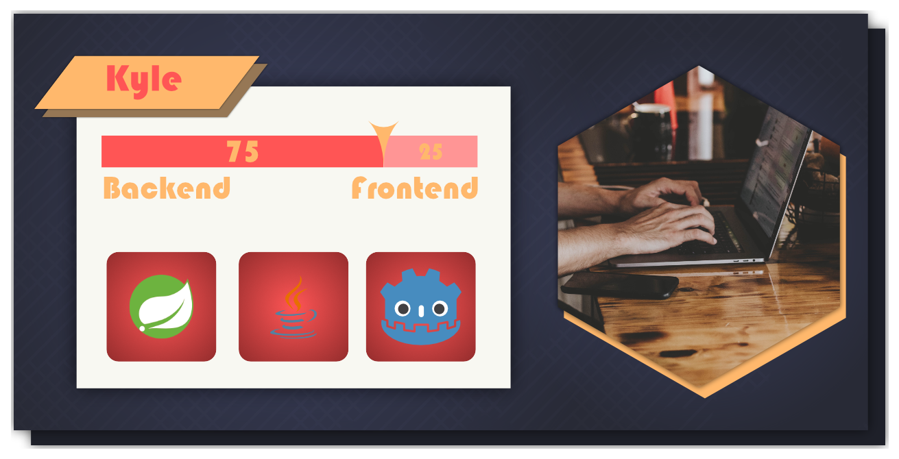

# Technologie-Stack

### Programming Languages and Technologies
&nbsp;
&nbsp;
&nbsp;
&nbsp;
&nbsp;
&nbsp;

  
&nbsp;
&nbsp;
&nbsp;
&nbsp;
&nbsp;
&nbsp;
&nbsp;
&nbsp;
&nbsp;
  

### Tools
&nbsp;
&nbsp;
&nbsp;
&nbsp;
&nbsp;
&nbsp;
&nbsp;

### Platforms
&nbsp;
&nbsp;
&nbsp;

# Latest Projects
<table border=0>
  <tr>
  <td width="50%" align="center">
      
  
      
  </td>
  <td>
   A small application to merge multiple PDFs together.
  </td>
  </tr>
</table>
